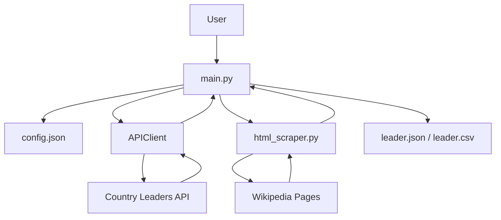

# Wikipedia Political Leaders Scraper
## Description

This project retrieves political leaders from the Country Leaders API and scrapes the first paragraph of each leader's Wikipedia page. The collected data is stored in a JSON file.

The project was developed as part of a collaborative data engineering exercise using Git Flow, REST APIs, web scraping, and Python.

## Features

- Retrieve countries and political leaders from an API
- Scrape Wikipedia pages using BeautifulSoup
- Clean and process text data
- Export results to a JSON or CSV file
- Error handling for API and scraping requests
- Modular code structure

## Repo Structure
```text
wikipedia-scraper/
├── dev/
│   ├── student_lien_sandbox.ipynb
│   └── student_sitara_sandbox.ipynb
├── src/
|   ├── __init__.py
|   ├── api_client.py
|   └── HTML_scraper.py
├── main.py
├── requirements.txt
├── .gitignore
├── README.md
├── config.json
├── leaders.CSV
└── leaders.json
```
## Architecture

The project is split into independent modules:

- api_client.py → Handles all API communication
- html_scraper.py → Handles HTML fetching and parsing
- main.py → Orchestrates the full pipeline

##  Architecture Diagram



```mermaid

```


## Installation

-  Clone the repository
-  Create a virtual environment 
-  Activate the virtual environment
-  Install dependencies

## Requirements

- Python 3.10+
- requests
- beautifulsoup4

## Usage

Run the full pipeline:
```
python main.py
```
The script will:

- Load API configuration from config.json
- Connect to the Country Leaders API
- Retrieve leaders for each country
- Scrape each leader's Wikipedia page
- Extract and clean the first meaningful paragraph
- Add the biography to the leader record
- Export the results to either:
```
leader.csv
leader.json
```
## Acknowledgements

This project was completed as part of the **AI Bootcamp** at **BeCode.org**. The assignment focused on applying software engineering best practices, including Git Flow collaboration, API integration, web scraping, data processing, and modular Python development.

## Contributors

- 1. Lien Kim

    https://www.linkedin.com/in/lienkt0110/

- 2. Sitara Sachidanandan

    https://www.linkedin.com/in/sitara-sachidanandan/


